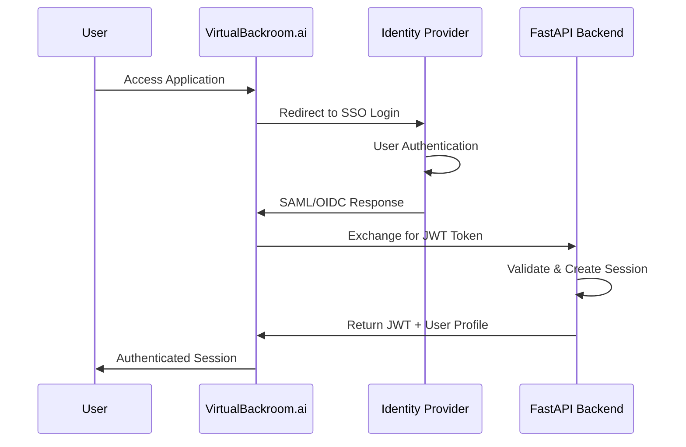

# Enterprise SSO Integration Strategy
**Document:** SSO-STRATEGY-001  
**Date:** 2024-01-15  
**Version:** 1.0  
**Classification:** Technical Implementation Guide  

## Overview

VirtualBackroom.ai V2.0 implements enterprise-grade Single Sign-On (SSO) integration to support seamless authentication for organizations using Microsoft Azure AD, Google Workspace, or other SAML/OIDC-compliant identity providers. This document outlines the technical implementation, security considerations, and operational procedures for enterprise SSO deployment.

## Supported Identity Providers

### Primary Enterprise Providers

**Microsoft Azure Active Directory (Azure AD)**
- **Protocol:** SAML 2.0 / OpenID Connect
- **Market Share:** 60% of enterprise customers
- **Features:** Conditional Access, MFA, Group-based permissions
- **Implementation Priority:** High

**Google Workspace (formerly G Suite)**
- **Protocol:** SAML 2.0 / OpenID Connect
- **Market Share:** 25% of enterprise customers  
- **Features:** Security Center, 2-Step Verification, Admin SDK
- **Implementation Priority:** High

**Okta**
- **Protocol:** SAML 2.0 / OpenID Connect
- **Market Share:** 10% of enterprise customers
- **Features:** Universal Directory, Adaptive MFA, Lifecycle Management
- **Implementation Priority:** Medium

**Additional Supported Providers**
- Auth0 (Development and small enterprise)
- PingIdentity (Large enterprise)
- OneLogin (Mid-market)
- ADFS (Microsoft on-premises)
- Generic SAML 2.0 providers

## Technical Architecture

### 1. Authentication Flow



### 2. Backend Implementation

**FastAPI Authentication Service**
```python
# /src/core/sso_auth.py
from fastapi import HTTPException, Depends
from fastapi.security import HTTPBearer
from authlib.integrations.starlette_client import OAuth
from authlib.integrations.starlette_client import OAuthError
import jwt
from datetime import datetime, timedelta
from typing import Optional, Dict, Any

class SSOAuthenticator:
    """Enterprise SSO authentication handler"""
    
    def __init__(self):
        self.oauth = OAuth()
        self._configure_providers()
    
    def _configure_providers(self):
        """Configure supported SSO providers"""
        
        # Microsoft Azure AD
        self.oauth.register(
            name='microsoft',
            client_id=settings.MICROSOFT_CLIENT_ID,
            client_secret=settings.MICROSOFT_CLIENT_SECRET,
            server_metadata_url='https://login.microsoftonline.com/{tenant_id}/v2.0/.well-known/openid_configuration',
            client_kwargs={
                'scope': 'openid email profile User.Read'
            }
        )
        
        # Google Workspace
        self.oauth.register(
            name='google',
            client_id=settings.GOOGLE_CLIENT_ID,
            client_secret=settings.GOOGLE_CLIENT_SECRET,
            server_metadata_url='https://accounts.google.com/.well-known/openid-configuration',
            client_kwargs={
                'scope': 'openid email profile'
            }
        )
        
        # Okta
        self.oauth.register(
            name='okta',
            client_id=settings.OKTA_CLIENT_ID,
            client_secret=settings.OKTA_CLIENT_SECRET,
            server_metadata_url=f'https://{settings.OKTA_DOMAIN}/.well-known/openid-configuration',
            client_kwargs={
                'scope': 'openid email profile groups'
            }
        )
    
    async def initiate_sso_login(self, provider: str, redirect_uri: str) -> str:
        """Initiate SSO login flow"""
        try:
            client = self.oauth.create_client(provider)
            return await client.authorize_redirect(redirect_uri)
        except Exception as e:
            raise HTTPException(status_code=400, detail=f"SSO initialization failed: {str(e)}")
    
    async def handle_sso_callback(self, provider: str, authorization_code: str) -> Dict[str, Any]:
        """Handle SSO callback and extract user information"""
        try:
            client = self.oauth.create_client(provider)
            token = await client.authorize_access_token(authorization_code)
            user_info = await client.parse_id_token(token)
            
            return {
                'provider': provider,
                'external_id': user_info.get('sub'),
                'email': user_info.get('email'),
                'name': user_info.get('name'),
                'groups': user_info.get('groups', []),
                'tenant_id': user_info.get('tid'),  # Microsoft-specific
                'domain': user_info.get('hd')       # Google-specific
            }
        except OAuthError as e:
            raise HTTPException(status_code=401, detail=f"SSO authentication failed: {str(e)}")
    
    def generate_jwt_token(self, user_data: Dict[str, Any]) -> str:
        """Generate internal JWT token from SSO user data"""
        payload = {
            'user_id': user_data['user_id'],
            'email': user_data['email'],
            'organization_id': user_data['organization_id'],
            'roles': user_data['roles'],
            'provider': user_data['provider'],
            'exp': datetime.utcnow() + timedelta(hours=8),
            'iat': datetime.utcnow()
        }
        return jwt.encode(payload, settings.JWT_SECRET, algorithm='HS256')
```

### 3. User and Organization Management

**Database Schema for SSO Integration**
```sql
-- Enhanced user table for SSO
ALTER TABLE users ADD COLUMN sso_provider VARCHAR(50);
ALTER TABLE users ADD COLUMN sso_external_id VARCHAR(255);
ALTER TABLE users ADD COLUMN sso_tenant_id VARCHAR(255);
ALTER TABLE users ADD COLUMN last_sso_login TIMESTAMP;
ALTER TABLE users ADD COLUMN sso_groups TEXT[];

-- Create unique constraint for SSO mapping
CREATE UNIQUE INDEX idx_users_sso_mapping ON users(sso_provider, sso_external_id) 
WHERE sso_provider IS NOT NULL AND sso_external_id IS NOT NULL;

-- Organization SSO configuration
CREATE TABLE organization_sso_config (
    id UUID PRIMARY KEY DEFAULT gen_random_uuid(),
    organization_id UUID REFERENCES organizations(id) ON DELETE CASCADE,
    provider VARCHAR(50) NOT NULL, -- 'microsoft', 'google', 'okta', etc.
    configuration JSONB NOT NULL, -- Provider-specific config
    is_active BOOLEAN DEFAULT true,
    created_at TIMESTAMP DEFAULT CURRENT_TIMESTAMP,
    updated_at TIMESTAMP DEFAULT CURRENT_TIMESTAMP,
    
    -- Audit fields
    created_by UUID REFERENCES users(id),
    updated_by UUID REFERENCES users(id),
    
    UNIQUE(organization_id, provider)
);

-- SSO login audit trail
CREATE TABLE sso_login_audit (
    id UUID PRIMARY KEY DEFAULT gen_random_uuid(),
    user_id UUID REFERENCES users(id),
    organization_id UUID REFERENCES organizations(id),
    provider VARCHAR(50) NOT NULL,
    login_timestamp TIMESTAMP DEFAULT CURRENT_TIMESTAMP,
    ip_address INET,
    user_agent TEXT,
    success BOOLEAN NOT NULL,
    failure_reason TEXT,
    session_id VARCHAR(255),
    
    -- Multi-factor authentication info
    mfa_used BOOLEAN DEFAULT false,
    mfa_method VARCHAR(50),
    
    -- Device and location info
    device_info JSONB,
    location_info JSONB
);
```

### 4. Security Implementation

**Multi-Factor Authentication (MFA) Integration**
```python
# /src/core/mfa_handler.py
from typing import Dict, Optional
import pyotp
import qrcode
from io import BytesIO
import base64

class MFAHandler:
    """Handle multi-factor authentication requirements"""
    
    def generate_mfa_secret(self, user_email: str) -> str:
        """Generate TOTP secret for user"""
        return pyotp.random_base32()
    
    def generate_qr_code(self, user_email: str, secret: str) -> str:
        """Generate QR code for MFA setup"""
        totp_uri = pyotp.totp.TOTP(secret).provisioning_uri(
            name=user_email,
            issuer_name="VirtualBackroom.ai"
        )
        
        qr = qrcode.QRCode(version=1, box_size=10, border=5)
        qr.add_data(totp_uri)
        qr.make(fit=True)
        
        img = qr.make_image(fill_color="black", back_color="white")
        buffer = BytesIO()
        img.save(buffer, format='PNG')
        buffer.seek(0)
        
        return base64.b64encode(buffer.getvalue()).decode()
    
    def verify_mfa_token(self, secret: str, token: str) -> bool:
        """Verify TOTP token"""
        totp = pyotp.TOTP(secret)
        return totp.verify(token, valid_window=1)
    
    def check_mfa_requirement(self, organization_config: Dict) -> bool:
        """Check if MFA is required for organization"""
        return organization_config.get('require_mfa', False)
```

**Role-Based Access Control (RBAC)**
```python
# /src/core/rbac.py
from enum import Enum
from typing import List, Dict, Set
from functools import wraps
from fastapi import HTTPException, Depends

class Permission(Enum):
    # Document management
    UPLOAD_DOCUMENTS = "upload_documents"
    VIEW_DOCUMENTS = "view_documents"
    DELETE_DOCUMENTS = "delete_documents"
    
    # Analysis operations
    RUN_ANALYSIS = "run_analysis"
    VIEW_ANALYSIS_RESULTS = "view_analysis_results"
    EXPORT_REPORTS = "export_reports"
    
    # Model management
    COMPARE_MODELS = "compare_models"
    VIEW_MODEL_PERFORMANCE = "view_model_performance"
    CONFIGURE_MODELS = "configure_models"
    
    # Organization administration
    MANAGE_USERS = "manage_users"
    CONFIGURE_SSO = "configure_sso"
    VIEW_AUDIT_LOGS = "view_audit_logs"
    MANAGE_BILLING = "manage_billing"
    
    # Standards library
    VIEW_STANDARDS = "view_standards"
    ADD_CUSTOM_STANDARDS = "add_custom_standards"
    MODIFY_STANDARDS = "modify_standards"

class Role(Enum):
    # Standard user roles
    VIEWER = "viewer"
    ANALYST = "analyst" 
    QUALITY_MANAGER = "quality_manager"
    
    # Administrative roles
    ORG_ADMIN = "org_admin"
    SYSTEM_ADMIN = "system_admin"

# Role-Permission Mapping
ROLE_PERMISSIONS: Dict[Role, Set[Permission]] = {
    Role.VIEWER: {
        Permission.VIEW_DOCUMENTS,
        Permission.VIEW_ANALYSIS_RESULTS,
        Permission.VIEW_STANDARDS
    },
    Role.ANALYST: {
        Permission.UPLOAD_DOCUMENTS,
        Permission.VIEW_DOCUMENTS,
        Permission.RUN_ANALYSIS,
        Permission.VIEW_ANALYSIS_RESULTS,
        Permission.EXPORT_REPORTS,
        Permission.COMPARE_MODELS,
        Permission.VIEW_MODEL_PERFORMANCE,
        Permission.VIEW_STANDARDS
    },
    Role.QUALITY_MANAGER: {
        # All analyst permissions plus:
        Permission.DELETE_DOCUMENTS,
        Permission.CONFIGURE_MODELS,
        Permission.ADD_CUSTOM_STANDARDS,
        Permission.VIEW_AUDIT_LOGS
    },
    Role.ORG_ADMIN: {
        # All permissions except system-wide admin
        Permission.MANAGE_USERS,
        Permission.CONFIGURE_SSO,
        Permission.MANAGE_BILLING,
        Permission.MODIFY_STANDARDS
    },
    Role.SYSTEM_ADMIN: {
        # All permissions - platform administration
        *[p for p in Permission]
    }
}

def require_permission(permission: Permission):
    """Decorator to require specific permission for endpoint access"""
    def decorator(func):
        @wraps(func)
        async def wrapper(*args, **kwargs):
            current_user = kwargs.get('current_user') or args[-1]  # Assuming current_user is last dependency
            
            if not current_user:
                raise HTTPException(status_code=401, detail="Authentication required")
            
            user_permissions = get_user_permissions(current_user)
            if permission not in user_permissions:
                raise HTTPException(
                    status_code=403, 
                    detail=f"Permission {permission.value} required"
                )
            
            return await func(*args, **kwargs)
        return wrapper
    return decorator

def get_user_permissions(user) -> Set[Permission]:
    """Get all permissions for a user based on their roles"""
    permissions = set()
    for role_name in user.roles:
        try:
            role = Role(role_name)
            permissions.update(ROLE_PERMISSIONS.get(role, set()))
        except ValueError:
            # Handle unknown roles gracefully
            continue
    return permissions
```

## 5. Provider-Specific Configuration

### Microsoft Azure AD Configuration

**Application Registration:**
```json
{
  "displayName": "VirtualBackroom.ai V2.0",
  "signInAudience": "AzureADMultipleOrgs",
  "api": {
    "acceptMappedClaims": null,
    "knownClientApplications": [],
    "oauth2PermissionScopes": [],
    "preAuthorizedApplications": [],
    "requestedAccessTokenVersion": 2
  },
  "appRoles": [
    {
      "allowedMemberTypes": ["User"],
      "description": "Quality Manager with elevated permissions",
      "displayName": "Quality Manager",
      "id": "quality-manager-role-id",
      "isEnabled": true,
      "value": "quality_manager"
    },
    {
      "allowedMemberTypes": ["User"],
      "description": "Organization Administrator",
      "displayName": "Organization Admin", 
      "id": "org-admin-role-id",
      "isEnabled": true,
      "value": "org_admin"
    }
  ],
  "web": {
    "redirectUris": [
      "https://app.virtualbackroom.ai/auth/microsoft/callback",
      "https://staging.virtualbackroom.ai/auth/microsoft/callback"
    ],
    "logoutUrl": "https://app.virtualbackroom.ai/auth/logout"
  },
  "requiredResourceAccess": [
    {
      "resourceAppId": "00000003-0000-0000-c000-000000000000",
      "resourceAccess": [
        {
          "id": "e1fe6dd8-ba31-4d61-89e7-88639da4683d", 
          "type": "Scope"
        }
      ]
    }
  ]
}
```

**Claims Mapping:**
```python
# Microsoft Azure AD claims mapping
MICROSOFT_CLAIMS_MAPPING = {
    'user_id': 'oid',           # Object ID in Azure AD
    'email': 'email',           # Email address
    'name': 'name',             # Full name
    'given_name': 'given_name', # First name
    'family_name': 'family_name', # Last name
    'tenant_id': 'tid',         # Azure AD tenant ID
    'groups': 'groups',         # Group memberships
    'roles': 'roles',           # Application roles
    'department': 'department', # Department
    'job_title': 'jobTitle'     # Job title
}
```

### Google Workspace Configuration

**OAuth 2.0 Setup:**
```json
{
  "web": {
    "client_id": "your-client-id.apps.googleusercontent.com",
    "project_id": "virtualbackroom-sso",
    "auth_uri": "https://accounts.google.com/o/oauth2/auth",
    "token_uri": "https://oauth2.googleapis.com/token",
    "auth_provider_x509_cert_url": "https://www.googleapis.com/oauth2/v1/certs",
    "client_secret": "your-client-secret",
    "redirect_uris": [
      "https://app.virtualbackroom.ai/auth/google/callback"
    ],
    "javascript_origins": [
      "https://app.virtualbackroom.ai"
    ]
  }
}
```

**Directory API Integration:**
```python
# Google Workspace Directory API integration
from googleapiclient.discovery import build
from google.oauth2.credentials import Credentials

class GoogleWorkspaceIntegration:
    """Integration with Google Workspace Admin SDK"""
    
    def __init__(self, credentials: Credentials):
        self.service = build('admin', 'directory_v1', credentials=credentials)
    
    async def get_user_groups(self, user_email: str) -> List[str]:
        """Retrieve user's group memberships"""
        try:
            result = self.service.groups().list(userKey=user_email).execute()
            return [group['name'] for group in result.get('groups', [])]
        except Exception as e:
            logger.error(f"Failed to retrieve groups for {user_email}: {e}")
            return []
    
    async def get_organization_users(self, domain: str) -> List[Dict]:
        """Retrieve all users in organization domain"""
        try:
            result = self.service.users().list(domain=domain).execute()
            return result.get('users', [])
        except Exception as e:
            logger.error(f"Failed to retrieve users for domain {domain}: {e}")
            return []
```

## 6. Security and Compliance

### 6.1 Token Management

**JWT Token Structure:**
```python
# JWT token payload structure
{
    "sub": "user-uuid",                    # Subject (user ID)
    "email": "user@company.com",           # User email
    "name": "John Doe",                    # Full name
    "org_id": "org-uuid",                  # Organization ID
    "roles": ["quality_manager"],          # User roles
    "permissions": ["run_analysis", "export_reports"], # Computed permissions
    "sso_provider": "microsoft",           # SSO provider used
    "sso_tenant": "tenant-id",             # Provider tenant ID
    "mfa_verified": true,                  # MFA status
    "iss": "virtualbackroom.ai",           # Issuer
    "aud": "virtualbackroom-api",          # Audience
    "iat": 1640995200,                     # Issued at
    "exp": 1641024000,                     # Expires at
    "session_id": "session-uuid"           # Session identifier
}
```

**Token Validation Middleware:**
```python
# /src/core/auth_middleware.py
from fastapi import Request, HTTPException
from fastapi.security import HTTPBearer, HTTPAuthorizationCredentials
import jwt
from src.core.config import settings
from src.database.models import User, Organization

security = HTTPBearer()

async def get_current_user(credentials: HTTPAuthorizationCredentials = Depends(security)) -> User:
    """Extract and validate current user from JWT token"""
    try:
        payload = jwt.decode(
            credentials.credentials,
            settings.JWT_SECRET,
            algorithms=['HS256'],
            audience="virtualbackroom-api",
            issuer="virtualbackroom.ai"
        )
        
        user_id = payload.get('sub')
        if not user_id:
            raise HTTPException(status_code=401, detail="Invalid token: missing user ID")
        
        # Retrieve user from database
        user = await User.get_by_id(user_id)
        if not user or not user.is_active:
            raise HTTPException(status_code=401, detail="User not found or inactive")
        
        # Validate session
        session_id = payload.get('session_id')
        if not await validate_session(user_id, session_id):
            raise HTTPException(status_code=401, detail="Session expired or invalid")
        
        return user
        
    except jwt.ExpiredSignatureError:
        raise HTTPException(status_code=401, detail="Token expired")
    except jwt.InvalidTokenError:
        raise HTTPException(status_code=401, detail="Invalid token")

async def get_current_organization(current_user: User = Depends(get_current_user)) -> Organization:
    """Get current user's organization with validation"""
    organization = await Organization.get_by_id(current_user.organization_id)
    if not organization or not organization.is_active:
        raise HTTPException(status_code=403, detail="Organization not found or inactive")
    return organization
```

### 6.2 Session Management

**Secure Session Handling:**
```python
# /src/services/session_service.py
from typing import Optional
import redis
import json
from datetime import datetime, timedelta

class SessionService:
    """Manage user sessions with SSO integration"""
    
    def __init__(self, redis_client: redis.Redis):
        self.redis = redis_client
        self.session_ttl = 28800  # 8 hours
    
    async def create_session(self, user_id: str, sso_data: Dict) -> str:
        """Create new user session"""
        session_id = f"session:{user_id}:{int(datetime.utcnow().timestamp())}"
        
        session_data = {
            'user_id': user_id,
            'sso_provider': sso_data['provider'],
            'created_at': datetime.utcnow().isoformat(),
            'last_activity': datetime.utcnow().isoformat(),
            'ip_address': sso_data.get('ip_address'),
            'user_agent': sso_data.get('user_agent'),
            'mfa_verified': sso_data.get('mfa_verified', False)
        }
        
        await self.redis.setex(
            session_id,
            self.session_ttl,
            json.dumps(session_data)
        )
        
        return session_id
    
    async def validate_session(self, user_id: str, session_id: str) -> bool:
        """Validate existing session"""
        session_data = await self.redis.get(session_id)
        if not session_data:
            return False
        
        data = json.loads(session_data)
        if data['user_id'] != user_id:
            return False
        
        # Update last activity
        data['last_activity'] = datetime.utcnow().isoformat()
        await self.redis.setex(session_id, self.session_ttl, json.dumps(data))
        
        return True
    
    async def invalidate_session(self, session_id: str):
        """Invalidate user session"""
        await self.redis.delete(session_id)
    
    async def invalidate_all_user_sessions(self, user_id: str):
        """Invalidate all sessions for a user"""
        pattern = f"session:{user_id}:*"
        async for key in self.redis.scan_iter(match=pattern):
            await self.redis.delete(key)
```

## 7. Organization Onboarding

### 7.1 SSO Configuration Wizard

**Frontend Configuration Interface:**
```typescript
// Organization SSO setup component
interface SSOConfigData {
  provider: 'microsoft' | 'google' | 'okta' | 'saml'
  domain: string
  clientId: string
  clientSecret: string
  tenantId?: string          // Microsoft-specific
  workspaceDomain?: string   // Google-specific
  samlMetadataUrl?: string   // SAML providers
  customClaims?: Record<string, string>
  requireMFA: boolean
  autoProvisionUsers: boolean
  defaultRole: string
}

const SSOConfigurationWizard = () => {
  const [configData, setConfigData] = useState<SSOConfigData>()
  const [testResult, setTestResult] = useState<any>()
  
  const testConnection = async () => {
    // Test SSO configuration before saving
    const response = await fetch('/api/v1/auth/sso/test', {
      method: 'POST',
      headers: { 'Content-Type': 'application/json' },
      body: JSON.stringify(configData)
    })
    
    const result = await response.json()
    setTestResult(result)
  }
  
  // Configuration wizard implementation...
}
```

### 7.2 User Provisioning

**Automatic User Provisioning:**
```python
# /src/services/user_provisioning.py
from typing import Dict, Optional
from src.database.models import User, Organization
from src.core.rbac import Role

class UserProvisioningService:
    """Handle automatic user provisioning from SSO"""
    
    async def provision_user(self, 
                           sso_data: Dict, 
                           organization: Organization) -> User:
        """Create or update user from SSO data"""
        
        # Check if user already exists
        existing_user = await User.get_by_sso_id(
            sso_data['provider'], 
            sso_data['external_id']
        )
        
        if existing_user:
            # Update existing user
            return await self._update_user_from_sso(existing_user, sso_data)
        else:
            # Create new user
            return await self._create_user_from_sso(sso_data, organization)
    
    async def _create_user_from_sso(self, 
                                  sso_data: Dict, 
                                  organization: Organization) -> User:
        """Create new user from SSO data"""
        
        # Determine default role based on organization config
        default_role = organization.sso_config.get('default_role', 'analyst')
        
        # Map SSO groups to application roles if configured
        user_roles = self._map_sso_groups_to_roles(
            sso_data.get('groups', []),
            organization.sso_config.get('group_role_mapping', {})
        )
        
        if not user_roles:
            user_roles = [default_role]
        
        user_data = {
            'email': sso_data['email'],
            'first_name': sso_data.get('given_name', ''),
            'last_name': sso_data.get('family_name', ''),
            'organization_id': organization.id,
            'sso_provider': sso_data['provider'],
            'sso_external_id': sso_data['external_id'],
            'sso_tenant_id': sso_data.get('tenant_id'),
            'roles': user_roles,
            'is_active': True,
            'email_verified': True  # Trust SSO provider verification
        }
        
        return await User.create(user_data)
    
    def _map_sso_groups_to_roles(self, 
                               sso_groups: List[str], 
                               group_mapping: Dict[str, str]) -> List[str]:
        """Map SSO groups to application roles"""
        roles = []
        for group in sso_groups:
            if group in group_mapping:
                roles.append(group_mapping[group])
        return list(set(roles))  # Remove duplicates
```

## 8. Monitoring and Compliance

### 8.1 SSO Audit Logging

**Comprehensive Audit Trail:**
```python
# /src/services/sso_audit_service.py
from typing import Dict, Optional
from src.database.models import SSOLoginAudit
import geoip2.database
import user_agents

class SSOAuditService:
    """Comprehensive audit logging for SSO operations"""
    
    def __init__(self):
        self.geoip_reader = geoip2.database.Reader('/data/GeoLite2-City.mmdb')
    
    async def log_login_attempt(self,
                              user_id: Optional[str],
                              organization_id: Optional[str],
                              provider: str,
                              success: bool,
                              request_data: Dict) -> str:
        """Log SSO login attempt with detailed context"""
        
        # Parse user agent
        user_agent = user_agents.parse(request_data.get('user_agent', ''))
        device_info = {
            'browser': user_agent.browser.family,
            'browser_version': user_agent.browser.version_string,
            'os': user_agent.os.family,
            'os_version': user_agent.os.version_string,
            'device': user_agent.device.family
        }
        
        # Get location from IP
        location_info = {}
        try:
            ip_address = request_data.get('ip_address')
            if ip_address:
                response = self.geoip_reader.city(ip_address)
                location_info = {
                    'country': response.country.name,
                    'city': response.city.name,
                    'latitude': float(response.location.latitude),
                    'longitude': float(response.location.longitude)
                }
        except Exception:
            # GeoIP lookup failed - continue without location
            pass
        
        audit_record = SSOLoginAudit(
            user_id=user_id,
            organization_id=organization_id,
            provider=provider,
            ip_address=request_data.get('ip_address'),
            user_agent=request_data.get('user_agent'),
            success=success,
            failure_reason=request_data.get('error_message') if not success else None,
            session_id=request_data.get('session_id'),
            mfa_used=request_data.get('mfa_used', False),
            mfa_method=request_data.get('mfa_method'),
            device_info=device_info,
            location_info=location_info
        )
        
        await audit_record.save()
        return audit_record.id
    
    async def detect_anomalous_login(self, user_id: str, request_data: Dict) -> bool:
        """Detect potentially anomalous login patterns"""
        
        # Get recent login history
        recent_logins = await SSOLoginAudit.get_recent_logins(user_id, days=30)
        
        # Check for unusual location
        current_ip = request_data.get('ip_address')
        if current_ip and not self._is_known_location(recent_logins, current_ip):
            return True
        
        # Check for unusual device
        current_device = request_data.get('user_agent')
        if current_device and not self._is_known_device(recent_logins, current_device):
            return True
        
        # Check for rapid successive attempts
        if self._has_rapid_attempts(recent_logins):
            return True
        
        return False
```

### 8.2 Compliance Monitoring

**21 CFR Part 11 Compliance:**
```python
# Electronic signature and record integrity for SSO
class CFRComplianceService:
    """Ensure 21 CFR Part 11 compliance for SSO operations"""
    
    async def create_electronic_signature(self,
                                        user_id: str,
                                        action: str,
                                        document_id: Optional[str] = None) -> str:
        """Create electronic signature record"""
        
        signature_data = {
            'user_id': user_id,
            'action': action,
            'document_id': document_id,
            'timestamp': datetime.utcnow().isoformat(),
            'meaning': f"User {user_id} performed {action}",
            'method': 'sso_authenticated_session'
        }
        
        # Create tamper-evident hash
        signature_hash = self._create_signature_hash(signature_data)
        
        # Store in audit trail
        await ElectronicSignature.create({
            **signature_data,
            'signature_hash': signature_hash
        })
        
        return signature_hash
    
    def _create_signature_hash(self, data: Dict) -> str:
        """Create tamper-evident hash for electronic signature"""
        import hashlib
        import hmac
        
        message = json.dumps(data, sort_keys=True)
        signature = hmac.new(
            settings.SIGNATURE_SECRET.encode(),
            message.encode(),
            hashlib.sha256
        ).hexdigest()
        
        return signature
```

## 9. Deployment and Operations

### 9.1 Environment Configuration

**Environment Variables:**
```bash
# SSO Provider Configuration
MICROSOFT_CLIENT_ID=your-microsoft-client-id
MICROSOFT_CLIENT_SECRET=your-microsoft-client-secret
MICROSOFT_TENANT_ID=your-microsoft-tenant-id

GOOGLE_CLIENT_ID=your-google-client-id
GOOGLE_CLIENT_SECRET=your-google-client-secret
GOOGLE_WORKSPACE_DOMAIN=your-company.com

OKTA_CLIENT_ID=your-okta-client-id
OKTA_CLIENT_SECRET=your-okta-client-secret
OKTA_DOMAIN=your-org.okta.com

# JWT Configuration
JWT_SECRET=your-super-secure-jwt-secret
JWT_ALGORITHM=HS256
JWT_EXPIRATION_HOURS=8

# Session Configuration
REDIS_URL=redis://redis:6379/0
SESSION_TTL_SECONDS=28800

# Audit Configuration
GEOIP_DATABASE_PATH=/data/GeoLite2-City.mmdb
ENABLE_LOCATION_TRACKING=true
ENABLE_DEVICE_FINGERPRINTING=true
```

### 9.2 Infrastructure Requirements

**Redis Session Store:**
```yaml
# docker-compose.yml addition
services:
  redis:
    image: redis:7-alpine
    ports:
      - "6379:6379"
    volumes:
      - redis_data:/data
    command: redis-server --appendonly yes --maxmemory 512mb --maxmemory-policy allkeys-lru
    environment:
      - REDIS_PASSWORD=${REDIS_PASSWORD}
    networks:
      - backend

volumes:
  redis_data:
```

**Terraform Infrastructure:**
```hcl
# /iac/terraform/sso.tf
resource "aws_elasticache_replication_group" "session_store" {
  replication_group_id       = "virtualbackroom-sessions"
  description                = "Redis cluster for session management"
  node_type                  = "cache.t3.micro"
  port                       = 6379
  parameter_group_name       = "default.redis6.x"
  num_cache_clusters         = 2
  automatic_failover_enabled = true
  multi_az_enabled          = true
  
  subnet_group_name = aws_elasticache_subnet_group.session_store.name
  security_group_ids = [aws_security_group.redis.id]
  
  at_rest_encryption_enabled = true
  transit_encryption_enabled = true
  auth_token                 = var.redis_auth_token
  
  tags = {
    Name        = "VirtualBackroom Session Store"
    Environment = var.environment
    Component   = "Authentication"
  }
}

# Security group for Redis
resource "aws_security_group" "redis" {
  name_prefix = "virtualbackroom-redis-"
  vpc_id      = aws_vpc.main.id

  ingress {
    from_port       = 6379
    to_port         = 6379
    protocol        = "tcp"
    security_groups = [aws_security_group.api.id]
  }

  egress {
    from_port   = 0
    to_port     = 0
    protocol    = "-1"
    cidr_blocks = ["0.0.0.0/0"]
  }

  tags = {
    Name = "VirtualBackroom Redis Security Group"
  }
}
```

## 10. Testing and Validation

### 10.1 SSO Integration Testing

**Test Cases:**
1. **Provider Authentication Flow**
   - Microsoft Azure AD login/logout
   - Google Workspace login/logout
   - Okta login/logout
   - SAML generic provider

2. **User Provisioning**
   - New user automatic creation
   - Existing user updates
   - Role assignment from groups
   - Organization assignment

3. **Security Validation**
   - Token validation and expiration
   - Session management
   - MFA requirement enforcement
   - Permission-based access control

4. **Error Handling**
   - Provider unavailability
   - Invalid configurations
   - Network timeouts
   - Malformed responses

### 10.2 Performance Testing

**Load Testing Scenarios:**
- 1000 concurrent SSO logins
- Session validation under load
- Token refresh performance
- Database query optimization

## 11. Rollout Strategy

### 11.1 Phased Deployment

**Phase 1: Pilot Program (Month 1)**
- Select 3 friendly enterprise customers
- Microsoft Azure AD integration only
- Limited feature set
- Intensive monitoring and feedback

**Phase 2: Expanded Beta (Month 2)**
- 10 additional enterprise customers
- Google Workspace integration
- Full feature access
- Performance optimization

**Phase 3: General Availability (Month 3)**
- All enterprise customers
- Okta and generic SAML support
- Self-service configuration portal
- 24/7 monitoring and support

### 11.2 Success Metrics

**Technical Metrics:**
- SSO login success rate > 99%
- Authentication latency < 2 seconds
- Session validation performance < 100ms
- Zero security incidents

**Business Metrics:**
- Enterprise customer adoption rate
- Reduction in support tickets for authentication
- User satisfaction scores
- Time-to-onboard reduction

---

**Document Control:**
- **Created:** 2024-01-15
- **Author:** Senior Authentication Engineer
- **Reviewed:** Security Architecture Team
- **Approved:** Chief Technology Officer

**Related Documents:**
- Cybersecurity Plan v2.0
- 21 CFR Part 11 Compliance Strategy
- System Architecture Document
- User Management Procedures